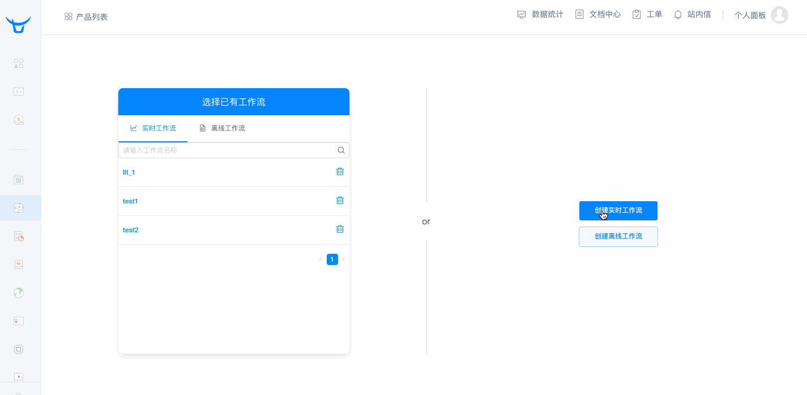
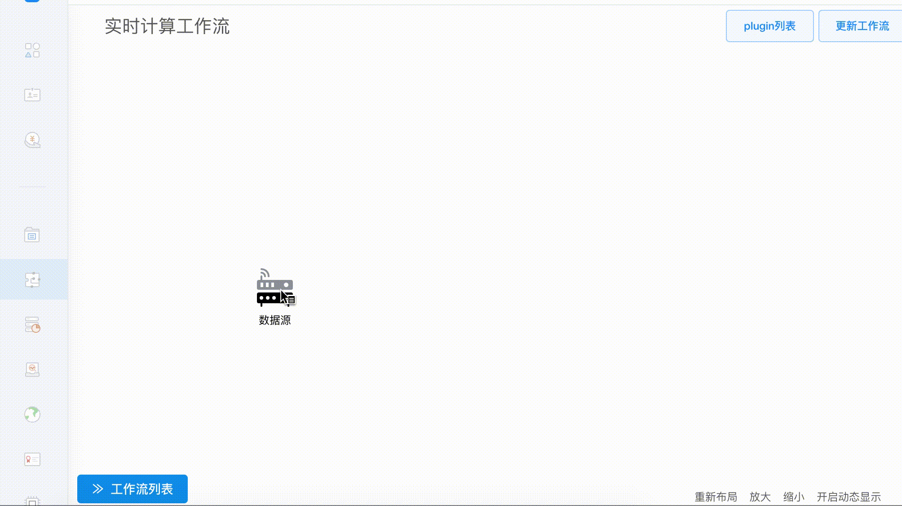

# pandora-js-sdk
浏览器端使用的Pandora 大数据客户端打点SDK

## 安装

将 ``src/pandora.js`` 复制到你的项目中，使用 ``require("..../pandora")`` 引入到你的项目中。

## API 文档

- ```
  QiniuPandora.pushToPandoraPipeline(repo, auth, data)
  ```

|  参数  |    类型    |                    说明                    |
| :--: | :------: | :--------------------------------------: |
| repo |  string  |                 实时数据流名称                  |
| auth |  string  | 鉴权信息，通过 AK、SK、RepoName 构造的 token。也可以用[签名生成工具](https://qiniu.github.io/pandora-docs/#/util/akutil)生成 |
| data | Object[] | 上报数据，以 Key-Value 的形式构造 Object，必须和实时数据流定义的字段格式一致。如果希望一次性上报多个数据，则传入一个包含它们的数组即可 |

##实时数据流

实时数据流是 Pandora 大数据工作流引擎的一部分。大数据工作流引擎是一个可视化的大数据接入、计算、导出平台。无论是简单的（流式/批量）计算还是复杂的（实时/离线）业务，都可以通过它来完成。它的核心是工作流引擎。

大数据工作流引擎（Workflow），它是一个数据流可视化编辑器，它类似于‘思维脑图’，使用户可以通过抽象自身的数据业务走向，把业务流程映射到页面上，更直观、更精简的来进行大数据分析流程管理；工作流引擎包含了数据接入（消息队列）、数据计算（Transform Serivice）、数据导出（Export Service）三大功能以及各类下游存储服务，包括时序数据库、日志检索服务以及对象存储等服务。对于用于基本的数据处理需求，无需编写任何代码即可完成整个数据的落地。

更多关于关于大数据工作流引擎的内容，请参考[Pandora 文档](https://qiniu.github.io/pandora-docs)。

使用 ``pandora-js-sdk`` ，可以将用户在浏览器上产生的行为、数据、事件上报到实时数据流。通过在七牛 Portal 上配置实时数据流，可以对上报的数据进行分析、处理，并最终存储并展示。

### 配置实时数据流

首先，你需要确认你的七牛账号开通了 Pandora 服务。

之后，进入“大数据工作流引擎“页面，点击“创建实时数据流”。此时会跳转到工作流编辑器。

我们首先看到的节点是数据源，这个节点用来接收用户的实时数据，也就是说，当这个节点被创建后，用户需要将自己的数据推送至这个数据源中，才可以继续进行下一步。具体数据源参数如下：

- 名称：必填项；命名规则: 1-128个字符,支持小写字母、数字、下划线；必须以大小写字母或下划线开头。
- 字段名称：必填项；用来标识字段唯一性；命名规则: 1-128个字符,支持小写字母、数字、下划线；必须以大小写字母或下划线开头。
- 字段类型：必填项；描述字段的数据类型。

填写完成相应信息后，点击**创建**按钮，第一个工作流就创建成功了。



**注意：只有在定义好数据源之后，才能使用 ``pandora-js-sdk`` 进行上报。**

参考之前的上报 API，``QiniuPandora.pushToPandoraPipeline(repo, auth, data)``。

- 其中 ``repo`` 字段对应你定义的数据源的**名称**。
- 其中 ``data`` 必须是数组，数组的每一个元素都是 Key-Value Object。它的结构和数据类型必须和你定义的数据源的**字段**对应一致。

### 自测是否能上报

在创建好自定义数据源，并将 ``pandora-js-sdk`` 集成到你的 Web App 中之后，建议立即上报一些测试数据，以确定一切妥当。首先，操作你的 App 让其调用 ``QiniuPandora.pushToPandoraPipeline(…);`` 上报一些测试数据。

之后右键点击数据源，选择查看数据。之后如果可以看到上传的测试数据，说明上报成功。


更多关于实时数据流的内容，请参考[Pandora - 实时数据流](https://qiniu.github.io/pandora-docs/#/quickstart/flow)。

## 存储上报的数据

我们可以将上报的数据直接存储在时序数据库中。在数据源上点击右键，选择导出任务->时序数据库。



## 样例：统计 PV、UV

在之前的例子中，我们上报的数据将最终存储在时序数据库中。我们可以使用 SQL 语句来查询、汇总上报的数据。

### 统计 PV

PV 即页面浏览量或点击量，用户每次刷新即被计算一次。我们只需要在用户每次浏览时上报一条记录，再统计某个页面一共一段时间内有多少条记录即可。

例如，加入上报的格式如下。这个 json 每当用户刷新一次，则上报一次。

```json
{
  "url": "/post/27321242",
  "device": "iPhone",
  "os": "iOS 10.0.1",
}
```

时序数据库内字段结构如下。

|  字段名称  |   类型   | 是否为 Tag |
| :----: | :----: | :-----: |
|  url   | string |    是    |
| device | string |    否    |
|   os   | string |    否    |
|  time  |  time  |         |

我们可以通过如下 SQL 语句，查询某一天内，某个 url 的 PV：

```sql
select count(*) as pv, url from series where time >= '2017-01-01T00:00:00Z' and time <= '2017-01-01T23:59:59Z' group by url
```

### 统计 UV

UV 指独立访客，访问网页的一个客户端为一个访客。一段时间内，内相同的客户端只被计算一次。

为了统计 UV，我们需要在每次上报的信息中加上一个字段来标明访客的唯一身份（identify 字段）。因此，在上报之前，我们要获取访客的 ``identify``。有 2 种方式获取。

#### 将 user ID 作为 identify

如果是已登录的用户，可以在前端直接把 user ID 作为 ``identify``。但这么做的缺点也很明显。对于未登录的用户，将无法追踪。

#### 生成随机 identify 并存储在 cookie 中

使用当前系统时间戳 + 随机数的方法，生成一个唯一的`` identify`` 字符串，并将`` identify`` 写入 cookie。在下次获取`` identify`` 的时候先检查 cookie，如果 cookie 中保存了上次生成的 ``identify`` 则直接从 cookie 中读取。

这样，同一台客户端，每次上报时都会带一个相同的 ``identify`` 字段。（直到浏览器清空 cookie 为止。）

#### 上报 identify

将 ``identify`` 字段一起上报：

```json
{
  "identify": "2798782637469187289378761",
  "url": "/post/27321242",
  "device": "iPhone",
  "os": "iOS 10.0.1",
}
```

时序数据库内字段结构如下。

|   字段名称   |   类型   | 是否为 Tag |
| :------: | :----: | :-----: |
| identify | string |    是    |
|   url    | string |    是    |
|  device  | string |    否    |
|    os    | string |    否    |
|   time   |  time  |         |

我们可以通过如下 SQL 语句，查询某一天内，某个 url 的 UV：

```sql
select count(identify) as uv, url from series where time >= '2017-01-01T00:00:00Z' and time <= '2017-01-01T23:59:59Z' group by url
```